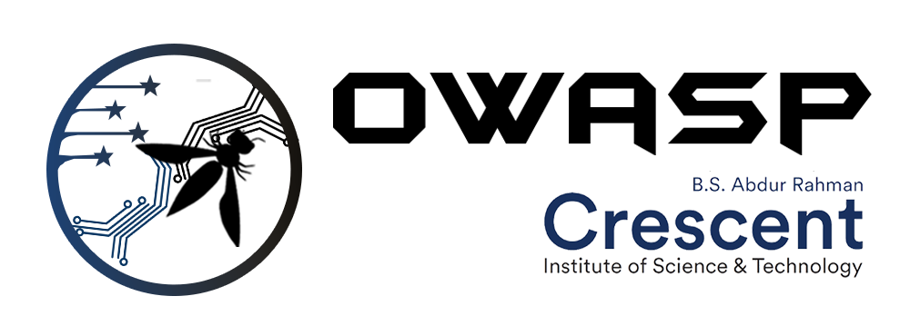

## Welcome

## Overview
The Open Web Application Security Project (OWASP) is a nonprofit foundation that works to improve the security of software. All of our projects ,tools, documents, forums, and chapters are free and open to anyone interested in improving application security.
OWASP B.S. Abdur Rahman Crescent Institute of Science and Technology is a Student Chapter which focuses on providing maximum Web Application Security 
knowledge, Ethical Hacking Skills, OSINT, Knowledge on different types of exploitations,Malware Analysis and other skills to students. Members will get to know about Cyber Laws and Policies. Members will learn Vulnerability Assessments and Penetration Testing and will get to know how to get bounties from Vulnerability Reward Programs (VRP) provided by various companies. The need for cybersecurity professionals has been growing rapidly,even faster than companies can hire—and that demand is expected to continue. The number of unfilled cybersecurity jobs worldwide grew 350% between 2013 and 2021,from 1 million to 3.5 million, according to Cybersecurity Ventures.

## Objectives
* To Conduct Guest lectures from renowned Cybersecurity Experts.
* Get the fundamentals strong first. Gain knowledge on Computer networks, 
  Operating systems, Servers, Linux and programming languages.
* Arrange theoretical and practical workshops on various Ethical Hacking techniques 
  and emerging technological trends.
* Master and get trained top-notch techniques in security field practically.
* Cybersecurity is a very broad field. Gain knowledge on various Web 2.0 and Web 3.0 
  technologies and its vulnerabilities. 
* Hardware securities demands are increasing day by day. This chapter provides 
  workshops on exploitations based on IoT devices and RFID Hacking and Wireless 
  Hacking.
* Have knowledge on different types of cryptography.
* Encourage and guide students to build mini projects.
* Facilitate internship and hands on industry training in partnership with 
  organizations.
* To collab with local OWASP Chapters and conduct events

Chapters are led by local leaders in accordance with the [Chapters Policy](/www-policy/operational/chapters). Financial contributions should only be made online using the authorized online donation button. 

Everyone are welcome and encouraged to participate in our [Projects](/projects/), [Local Chapters](/chapters/), [Events](/events/), [Online Groups](https://groups.google.com/a/owasp.com/){:target='_blank'}, and [Community Slack Channel](https://owasp.slack.com/){:target='_blank'}. We especially encourage diversity in all our initiatives. OWASP is a fantastic place to learn about application security, to network, and even to build your reputation as an expert. We also encourage you to be [become a member](/membership/) or consider a [donation](/donate/) to support our ongoing work.

Next Meeting/Event 
---------------------


-->
